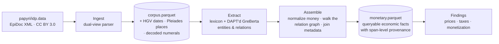

<div align="center">

# OIKONOMIA

**Turning 68,000 ancient Greek papyri into a queryable database of the everyday economy of Greco-Roman Egypt.**

[](pyproject.toml)
[](#data-models--licensing)
[](DATA_ATTRIBUTION.md)
[](CLAUDE.md)

</div>

---

OIKONOMIA reads the ~68,000 documentary papyri of Greco-Roman Egypt — tax
receipts, leases, loans, wage lists, census returns, private letters — and turns
them into a **structured, auditable database of everyday economic life**. Every
extracted fact traces back to a character span in a specific document at a pinned
corpus revision, so a historian can always open the papyrus and check it.

It is the first attempt to automate, at corpus scale, the information extraction
that economic historians have done by hand, one document at a time — spanning a
millennium from the Ptolemies through Roman, Byzantine, and early-Islamic Egypt.

## Results so far

| | |
|---|---|
| 📜 **Corpus parsed** | **67,980** documents, EpiDoc parse rate **1.000** |
| 🏷️ **Entity extraction** | strict F1 **0.737** / relaxed **0.837** (papyri-adapted GreBerta, 5-fold CV) |
| 🔗 **Relation extraction** | micro F1 **0.713** on the economic core |
| 🗂️ **Economic database** | **195,906** monetary facts + **350,206** gendered people + **21,895** principals, **100%** traceable to a source span |
| ✅ **Historically validated** | 2ᶜ AD wheat ≈ 12 dr/artaba (published: ~7–8) · the silver→gold monetization shift recovered *unsupervised* |
| 👩 **Women's autonomy** | the χωρὶς-κυρίου (unguarded) share of women transacting rises **0% → 39% → 80%** across the 3ᶜ–4ᶜ AD |
| ⚖️ **Women as principals** | **20.1%** of distinct principals, concentrated in property deals — sale **30%** / loan **28%** vs fiscal receipts **10%** |

The database already spans **227 distinct places** (linked to the [Pleiades](https://pleiades.stoa.org/)
gazetteer) across nine centuries, with viable long-run price series for wheat,
wine, oil, and barley, and named taxes (the *laographia* poll tax, the *demosia*
land taxes) tracked over time and region. Its schema, join model, query cookbook
and known pitfalls are documented in [`docs/database.md`](docs/database.md).

## How it works



Two principles hold the design together:

- **The model is a means, not the goal.** Entity recall and the genuinely
  ambiguous economic relations are learned; everything deterministic — monetary
  normalization, dates, place-linking, adjacency — is done by *auditable rules*,
  because a queryable historical record must be checkable, not black-box.
- **Provenance is structural.** Raw data is immutable and pinned to a git
  revision; every derived fact carries `(document, character span)` so nothing is
  un-sourceable.

## What's in the box

Three deliverables:

1. **Open models** — a papyri-adapted Greek extraction pair built on
   [GreBerta](https://huggingface.co/bowphs/GreBerta) with domain-adaptive
   pretraining on the corpus: **OIKONOMIA-Grammateus** (γραμματεύς, "the scribe")
   finds the entities, **OIKONOMIA-Homologia** (ὁμολογία, "the acknowledgment")
   links them into transactions.
2. **A derived database** — every transaction traceable to a span in a specific
   document at a specific corpus revision.
3. **Historical findings** — price and wage series across a millennium, the
   structure of taxation, monetization, women as economic principals.

## Quickstart

```bash
uv venv --python 3.12
uv pip install -e ".[dev]"

# Pin a corpus revision, then sync + build the processed table (~85s).
uv run oik ingest sync  --set ingest.idp_git_rev=<commit-sha>
uv run oik ingest build

# Assemble the economic database and package it.
uv run oik db build --sample 0   # → data/processed/db/monetary.parquet
uv run oik db prices             # → the clean price series
uv run oik db export             # → db/export/{documents,persons_distinct}.parquet + manifest.json
```

## Example: query the economic database

The tables are plain Parquet; [`docs/db.sql`](docs/db.sql) sets up one DuckDB view
per table so a question is one query away.

```bash
pip install duckdb
duckdb -init docs/db.sql
```

```sql
-- Wheat, drachmas per artaba, by century — reproduces the published series.
SELECT century, count(*) AS n, round(median(unit_price), 2) AS dr_per_artaba
FROM prices WHERE commodity = 'wheat' GROUP BY 1 ORDER BY 1;
--  -3 │ 14 │  2.53      2 │ 37 │ 13.33      3 │ 9 │ 3.76

-- Women's share of principals, by deal type.
SELECT deal_type, count(*) AS n,
       round(100.0 * sum(gender = 'female')
             / nullif(sum(gender IN ('male','female')), 0), 1) AS pct_women
FROM principals WHERE deal_type <> '?'
GROUP BY 1 HAVING sum(gender IN ('male','female')) >= 40 ORDER BY pct_women DESC;
--  sale 30.4 · loan 28.5 · contract 23.0 · receipt 10.2 · delivery 5.1
```

Every row is auditable — the span opens the papyrus:

```sql
SELECT substr(c.edited_text, p.person_start + 1, p.person_end - p.person_start)
FROM principals p JOIN read_parquet('data/processed/corpus.parquet') c USING (stem)
WHERE p.gender = 'female' AND p.guardian = 'without' LIMIT 3;
```

Full schema, join model, controlled vocabularies, query cookbook and the pitfalls
that will bite you: [`docs/database.md`](docs/database.md).

## Project layout

```
src/oikonomia/     pure-Python library — no Modal, no GPU deps; testable on a laptop
  ├─ ingest/       EpiDoc XML → corpus.parquet (dual text views, HGV metadata, numerals)
  ├─ labeling/     lexicon matcher + weak/silver labelers + apposition rules
  ├─ ner/ relations/  entity & relation encoders (model-side lives in modal_app/)
  └─ db/           Phase 9 — money/date normalization, person gender, principals,
                   coreference-lite identity → the queryable database (docs/database.md)
modal_app/         thin Modal orchestration (training); imports the library, never vice versa
resources/         curated knowledge (lexicons, genre map, schema) — reviewed as code
configs/           layered YAML configuration (local | modal)
data/              tiered by mutability; only data/gold and data/.manifests are tracked
docs/              architecture, per-phase write-ups, decision records, fact ledger
tests/             progressive tests — hand-computed fixtures over real EpiDoc
```

`CLAUDE.md` is the living project log: current state, phase history, and the
load-bearing facts never to re-derive.

## Status

| Phase | | |
|---|---|---|
| 0–4 | Foundation · Ingestion · Schema · Splits · **DAPT** | ✅ |
| 5–6 | Gold annotation (115 docs) · Silver labeling | ✅ |
| 7–8 | Entity NER (0.737) · Relation extraction (0.713) | ✅ frozen |
| 9 | Corpus → queryable database ([schema](docs/database.md)) | ✅ shipped |
| **10** | **Historical findings — the write-up** | 🔶 active |
| 11 | Model release — **Grammateus** + **Homologia** (carded; owner-run push) | 🔶 ready |

## Data, models & licensing

- **Code** — MIT (this repository).
- **Corpus & derived data** — [Duke Databank of Documentary Papyri](https://papyri.info)
  + [HGV](https://aquila.zaw.uni-heidelberg.de/) metadata, via
  [`papyri/idp.data`](https://github.com/papyri/idp.data), **CC BY 3.0**. See
  [`DATA_ATTRIBUTION.md`](DATA_ATTRIBUTION.md).
- **Models** — backbone and release licence lineage tracked in
  [`MODEL_LICENSES.md`](MODEL_LICENSES.md).

## Citation

If you use OIKONOMIA, please cite it — see [`CITATION.cff`](CITATION.cff).
