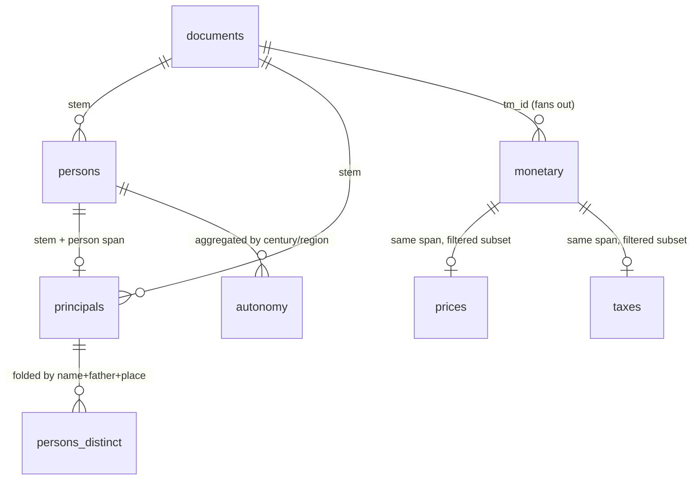

# The OIKONOMIA database (deliverable #2)

A structured, auditable database of everyday economic life in the ~68,000
documentary papyri of Greco-Roman Egypt. **Every row traces to a character span in
a specific document at a pinned corpus revision** — nothing is asserted that cannot
be checked against the Greek text.

- **Source corpus:** Duke Databank of Documentary Papyri (DDbDP) + HGV metadata,
  via [`papyri/idp.data`](https://github.com/papyri/idp.data), **licence CC BY 3.0**.
- **Pinned revision:** `d7a34f302d1e44e271256092c2b780733187b478` (recorded in every
  export's `manifest.json` as `corpus_rev`).
- **Universe:** the **61,249** documents that carry real edited text (of 67,980 DDbDP
  documents; the rest are empty/lost).
- **Format:** Apache Parquet, in `data/processed/db/`. Gitignored and
  re-derivable — the tables are outputs, the code and the pinned revision are the
  source of truth.

Contents: [Quick start](#quick-start) · [Tables at a glance](#tables-at-a-glance) ·
[How the tables join](#how-the-tables-join) · [Column reference](#column-reference) ·
[Controlled vocabularies](#controlled-vocabularies) · [Query cookbook](#query-cookbook) ·
[Pitfalls](#pitfalls-read-before-publishing-a-number) · [Regenerating](#regenerating-the-database)

---

## Quick start

The tables are plain Parquet, so anything that reads Parquet works. The examples
here use **DuckDB**, which queries the files in place with no import step.

```bash
pip install duckdb          # or: uv pip install duckdb   (not a project dependency)
duckdb -init docs/db.sql    # opens a shell with one view per table
```

[`docs/db.sql`](db.sql) creates a view per shipped table (`documents`, `persons`,
`principals`, `monetary`, `prices`, `taxes`, `persons_distinct`, `autonomy`, plus the
`monetary_silver` convenience view). Run it from the repository root — the paths are
relative. From Python:

```python
import duckdb
con = duckdb.connect()
con.execute(open("docs/db.sql").read())
con.sql("SELECT deal_type, count(*) FROM principals GROUP BY 1 ORDER BY 2 DESC").show()
```

Or with pandas, if you prefer frames:

```python
import pandas as pd
principals = pd.read_parquet("data/processed/db/principals.parquet")
```

---

## Tables at a glance

| table | file | rows | grain (one row =) | key | written by |
|---|---|---:|---|---|---|
| [`documents`](#documents--the-spine) | `db/export/documents.parquet` | 61,249 | one text document | `stem` | `oik db export` |
| [`persons_distinct`](#persons_distinct--coreference-lite-people) | `db/export/persons_distinct.parquet` | 17,362 | one distinct person | `person_id` | `oik db export` |
| [`monetary`](#monetary--the-fact-table) | `db/monetary.parquet` | 195,906 | one monetary amount | `tm_id` + char span | `oik db build --sample 0` |
| [`prices`](#prices--clean-price-observations) | `db/prices.parquet` | 98 | one clean price observation | `tm_id` + char span | `oik db prices` |
| [`taxes`](#taxes--clean-tax-payments) | `db/taxes.parquet` | 592 | one clean tax payment | `tm_id` + char span | `oik db taxes` |
| [`persons`](#persons--gendered-person-mentions) | `db/persons.parquet` | 350,206 | one PERSON mention | `stem` + char span | `oik db persons` |
| [`principals`](#principals--principals-gendered-and-deal-typed) | `db/principals.parquet` | 21,895 | one principal mention | `stem` + char span | `oik db principals` |
| [`autonomy`](#autonomy--the-published-curve) | `db/autonomy.parquet` | 32 | one time/region bucket | `dimension`+`bucket` | `oik db autonomy` |

`db/export/manifest.json` is the machine-readable version of this table: per-table
grain, key, row count and column list, plus `corpus_rev`, `schema_version`, licence
and generation timestamp.

Row counts are from the current build; re-running at the same `corpus_rev`
reproduces them exactly (every stage is deterministic).

---

## How the tables join

Two provenance keys, both resolving back to `corpus.parquet` at `corpus_rev`:

- **`stem`** — the *unique* per-document key (the DDbDP file stem). The
  person-derived tables (`persons`, `principals`, `documents`) key on it.
- **`tm_id`** — the Trismegistos document id. The money-derived tables (`monetary`,
  `prices`, `taxes`) key on it. **`tm_id` is not unique**: 61,249 documents carry
  only 60,862 distinct TM ids, so a `tm_id` join fans out across siblings
  (see [Pitfalls](#2-tm_id-is-not-unique-a-tm_id-join-fans-out)).



Referential integrity is exact in both directions that matter: 0 of 195,906
`monetary` rows have a `tm_id` absent from `documents`, and 0 of 21,895
`principals` rows have a `stem` absent from `documents`.

`prices` and `taxes` are *filtered, enriched subsets of* `monetary` — same grain,
same key, same columns plus a couple. They are not separate extractions; they are
`monetary` with the precision filters applied (see each table below).

Every char-span column pair (`amount_start`/`amount_end`, `person_start`/
`person_end`) indexes into `corpus.parquet.edited_text` for that document — the
canonical text view. Offsets are **0-based, end-exclusive** (Python slicing);
DuckDB's `substr` is 1-based, so the slice is
`substr(edited_text, start + 1, end - start)`.

---

## Column reference

Types are the Parquet physical types as DuckDB reports them. "cov" is the
percentage of rows where the column is non-null, measured on the current build —
it tells you what a filter on that column will cost you.

### `documents` — the spine

One row per text document: its metadata plus per-document counts folded in from
every other table. This is the queryable entry point ("3rd-c. AD sale documents
with a female principal"). Every document survives the fold; missing joins become
`0` / `false`, so a `0` means "nothing extracted", not "no data".

| column | type | cov | meaning |
|---|---|---|---|
| `stem` | VARCHAR | 100% | unique document key (DDbDP file stem) |
| `tm_id` | VARCHAR | 100% | Trismegistos id — **not unique**, 60,862 distinct |
| `century` | DOUBLE | 97.1% | signed century from the HGV date (+2 = 2nd c. AD, −2 = 2nd c. BC) |
| `place_pleiades` | DOUBLE | 74.1% | Pleiades id of the document's place |
| `deal_type` | VARCHAR | 100% | primary genre; `'?'` when the corpus gives none (17,932 docs) |
| `n_persons` | BIGINT | 100% | PERSON mentions in the document |
| `n_women_mentions`, `n_men_mentions` | BIGINT | 100% | of those, by attributed gender |
| `n_principals`, `n_women_principals` | BIGINT | 100% | principals (`PARTY_OF`/`PAID_*` heads), by gender |
| `has_guardian_woman` | BOOLEAN | 100% | a woman with a μετὰ-/χωρὶς-κυρίου formula is present |
| `n_money_facts` | BIGINT | 100% | monetary facts — **folded by `tm_id`, shared by TM-siblings** |
| `has_price`, `has_tax` | BOOLEAN | 100% | a clean price / tax row exists — also `tm_id`-shared |

### `monetary` — the fact table

One row per monetary amount that carries a currency, with its normalized value and
whatever the relation graph attaches: the commodity it prices, that commodity's
quantity and unit (→ a per-unit price), the tax it discharges. Built by
`oik db build` from the deterministic lexicon labeler plus the EpiDoc-decoded
`<num>` values — a graph walk, not a model.

| column | type | cov | meaning |
|---|---|---|---|
| `tm_id` | VARCHAR | 100% | document key (not unique) |
| `amount_start`, `amount_end` | BIGINT | 100% | char span of the amount in `edited_text` (0-based, end-exclusive) |
| `amount_text` | VARCHAR | 100% | the Greek surface string of that span |
| `value_num` | DOUBLE | 100% | the decoded numeral inside the span |
| `currency_id` | VARCHAR | 100% | canonical denomination id ([vocabulary](#currency_id)) |
| `system` | VARCHAR | 100% | `silver` \| `gold` \| `unknown` — **never aggregate across systems** |
| `value_base` | DOUBLE | 98.7% | value in drachmas (silver) or nomismata (gold) |
| `commodity_id` | VARCHAR | 3.9% | the priced commodity, when a `HAS_PRICE` link exists |
| `quantity` | DOUBLE | 3.4% | how much of it |
| `unit_id` | VARCHAR | 0.3% | the measure (`artaba`, `metretes`, …) |
| `unit_price_base` | DOUBLE | 3.3% | `value_base / quantity` — see [pitfall 4](#4-unit_price_base-over-divides) |
| `tax_id` | VARCHAR | 3.4% | the tax discharged, when a `CHARGED_UNDER` link exists |
| `confidence` | DOUBLE | 100% | labeler confidence — **constant 0.82 here**, carries no information |
| `date_lo`, `date_hi`, `date_mid` | DOUBLE | 94–99% | HGV date bounds and midpoint, signed years (negative = BC) |
| `century` | DOUBLE | 94.3% | signed century (range −4 … +10) |
| `bin50` | DOUBLE | 94.3% | start year of the 50-year bin, floored toward −∞ (`−124 → −150`) |
| `place_pleiades` | DOUBLE | 80.7% | Pleiades id |
| `genres` | VARCHAR | 100% | **JSON array as a string**, e.g. `["list", "account"]` ([how to query](#7-genres-is-a-json-string)) |

The low `commodity_id` / `tax_id` coverage is expected: most amounts in a papyrus
are bare sums (a receipt total, a wage, a rent) with no priced commodity attached.
The 3.9% that do are what the price series is made of.

### `prices` — clean price observations

`monetary` restricted to genuine, comparable **unit prices**, then enriched. The
filters (in `oikonomia.db.prices`) drop: the `value_num == quantity` double-link
artifact (48% of naive candidates), bronze `chalkous`, units that are not the
commodity's own dry/liquid measure, and implausible quantity/price combinations.
Precision over recall — 98 rows is the honest cost of a series you can publish.

All `monetary` columns, plus:

| column | type | meaning |
|---|---|---|
| `unit_price` | DOUBLE | drachmas per unit — the series value |
| `commodity` | VARCHAR | `wheat` (70) \| `wine` (14) \| `barley` (11) \| `oil` (3) |

### `taxes` — clean tax payments

`monetary` restricted to rows carrying a named tax, cleaned the same way. These are
**payments** (often installments), not tax *rates*. Cleaner than prices because no
per-unit division is involved.

All `monetary` columns, plus:

| column | type | meaning |
|---|---|---|
| `payment` | DOUBLE | the payment in drachmas |
| `tax` | VARCHAR | `laographia` (539, the poll tax) \| `demosia` (53, the land tax) |

### `persons` — gendered person mentions

Gender and guardian status for **every** PERSON span the NER model found across the
corpus (1.37M entities → 350,206 PERSON mentions). One row per *mention*, not per
person. Drives the autonomy finding.

| column | type | cov | meaning |
|---|---|---|---|
| `stem`, `tm_id` | VARCHAR | 100% | document keys |
| `person_start`, `person_end` | BIGINT | 100% | char span of the mention |
| `person_text` | VARCHAR | 100% | the full mention as written ("name son-of-father …") |
| `head_text` | VARCHAR | 100% | the person's own name, split out of the blob |
| `father_text` | VARCHAR | 36.8% | the patronymic, when present |
| `gender` | VARCHAR | 100% | `male` (82,817) \| `female` (22,901) \| `unknown` (244,488) |
| `gender_basis` | VARCHAR | 100% | which rule decided it ([vocabulary](#gender_basis)) |
| `gender_confidence` | DOUBLE | 100% | 0.0 (unknown) … 0.97 (guardian formula) |
| `guardian` | VARCHAR | 100% | `with` (1,628) \| `without` (143) \| `none` (348,435) |
| `date_mid`, `century`, `bin50` | DOUBLE | ~96% | document date |
| `place_pleiades` | DOUBLE | 81.7% | Pleiades id |
| `genres` | VARCHAR | 100% | JSON array string |

Only 30% of mentions are gender-attributable, and that is by design: the rules fire
only when a name or formula is decisive, and record *which* rule fired, rather than
guessing. `guardian` is the μετὰ-κυρίου (with a guardian) / χωρὶς-κυρίου (acting
alone) formula, typed.

### `principals` — principals, gendered and deal-typed

The people a deal turns on: a PERSON the relation model links as `PARTY_OF` a
transaction, or `PAID_BY`/`PAID_TO` an amount, joined to its already-validated
gender/guardian/patronymic from `persons`. 21,895 rows across 11,002 documents.

All the person columns above, plus:

| column | type | cov | meaning |
|---|---|---|---|
| `roles` | VARCHAR | 100% | sorted, `\|`-joined subset of `party`, `payer`, `payee` ([vocabulary](#roles)) |
| `transaction_term` | VARCHAR | 69% | the Greek verb/noun naming the deal (`ὁμολογῶ`, `ἐμίσθωσεν`, …) |
| `deal_type` | VARCHAR | 100% | the document's primary genre; `'?'` for 3,514 rows |
| `confidence` | DOUBLE | 100% | strongest principal-relation confidence, 0.34 … 1.00 (median 0.85) — **this one is informative**, filter on it |

`father_text` coverage is higher here (53.9%) than in `persons`, because principals
are named formally in contracts.

### `persons_distinct` — coreference-lite people

Principal *mentions* folded into distinct *people* by a conservative surface key:
(normalized own name, normalized patronymic, place). This answers "how many distinct
women", not "how many mentions". It **under-merges** (a person named without their
father, or appearing in two nomes, splits into two rows), so the count is an **upper
bound** on the true number of people — the safe direction for a "not fewer than"
claim. It is not full prosopographical coreference; see `oikonomia.db.identity`.

| column | type | meaning |
|---|---|---|
| `person_id` | VARCHAR | stable 16-hex-char hash of the identity key; unique, and identical across rebuilds |
| `head_text`, `father_text`, `place_pleiades` | VARCHAR/DOUBLE | representative name / patronymic / place |
| `gender` | VARCHAR | folded across mentions: an attributed sex beats `unknown`, majority wins — `female` 1,414 \| `male` 5,608 \| `unknown` 10,340 |
| `guardian` | VARCHAR | folded with `without` winning: one unambiguous χωρὶς-κυρίου attestation establishes the person acted alone |
| `n_mentions` | BIGINT | how many mentions folded into this person (max 32) |
| `deal_types` | VARCHAR | `\|`-joined set of deal types the person appears in |
| `first_century` | DOUBLE | earliest century of attestation |

### `autonomy` — the published curve

A derived summary, not a fact table: the χωρὶς-κυρίου share of guardian-formula
women, by century and by region. It is shipped so the headline finding is
inspectable, not as a source of new facts — to re-slice the question by nome,
deal type or a different time granularity, group `principals` yourself.

| column | type | meaning |
|---|---|---|
| `dimension` | VARCHAR | `century` (8 rows) or `region` (24 rows) |
| `bucket` | VARCHAR | the century (as a signed number in a string, e.g. `"3.0"`) or the place name |
| `n_with`, `n_without` | BIGINT | women attested with / without a guardian |
| `n` | BIGINT | `n_with + n_without` |
| `autonomous_share` | DOUBLE | `n_without / n` |

---

## Controlled vocabularies

Ids are canonical lexicon ids (`entry_id`), not surface forms — the labeler
resolves inflected Greek to these before anything is written.

#### `system`
`silver` (140,040) — the Ptolemaic–Roman drachma system, base unit the drachma ·
`gold` (54,771) — the Byzantine solidus system, base unit the nomisma ·
`unknown` (1,095) — a money word with no fixed denomination.

#### `currency_id`
**Silver ladder** (1 talent = 6000 drachmas, 1 drachma = 6 obols, 1 obol = 8 chalkoi):
`drachma` 65,672 · `obol` 23,253 · `talent` 12,513 · `diobol` 7,317 · `triobol` 7,099 ·
`chalkous` 6,745 · `hemiobelion` 6,680 · `tetrobol` 6,346 · `pentobol` 3,422 ·
`argyrion` 993 (generic "silver money", no denomination → `value_base` is null).
**Gold** (24 keratia = 1 nomisma): `nomisma` 36,168 · `keration` 18,047 · `chrysion` (generic).

#### `commodity_id`
`grain` 2,098 · `garden` 1,066 · `wheat` 1,057 · `wine` 758 · `oil` 673 · `barley` 429 ·
`donkey` 395 · `hay` 212 · `vegetables` 161 · `land` 149 · `house` 148 (+ a long tail).

#### `unit_id`
`artaba` 399 (dry measure) · `aroura` 59 (land) · `metretes` 34 and `keramion` 28
(liquid) · `xestes` · `kotyle` · `choinix` · `litra` · `naubion` · `pechys` · `myriad`.

#### `tax_id`
`prosdiagraphomena` 2,788 (Roman surcharge) · `demosia` 1,722 (land tax) · `phoros` 700 ·
`laographia` 574 (poll tax) · `merismos` 349 · `phylakitikon` 254 (Ptolemaic police tax) ·
`telesma` 110 · `stephanikon` 40 · `genema` 36 · `syntaxis` 17.

#### `deal_type`
The document's primary genre, from the corpus genre map. In `documents`:
`?` 17,932 · `receipt` 15,194 · `contract` 5,117 · `list` 4,193 · `letter_private` 3,603 ·
`account` 3,342 · `mummy_label` 2,212 · `order` 2,146 · `petition` 1,908 · `letter` 1,724 ·
`letter_official` 1,228 · `declaration` 734 · `register` 643 · `delivery` 417 · `sale` 318
(+ `loan`, `lease`, and a tail). **`?` is "the corpus records no genre", not "other"** —
always exclude it rather than treating it as a category.

#### `gender_basis`
Why a gender was assigned, in precision order: `guardian` 1,770 (a κύριος formula —
conf 0.97) · `nomen` 21,864 (Αὐρήλιος/Αὐρηλία — 0.9) · `kin` 5,781 (θυγάτηρ/υἱός — 0.9) ·
`gazetteer` 31,153 (attested name list — 0.8) · `egypt_prefix` 45,122 (Egyptian `Τα-`
female / `Πα-` male — 0.72) · `ethnic` 28 · `none` 244,488 (no rule fired → `unknown`).

#### `guardian`
`with` — a μετὰ κυρίου formula (the woman transacts under a guardian) ·
`without` — χωρὶς κυρίου (she transacts alone) · `none` — no formula in the window.
Validation against the 115-document human gold showed the `with` side is
over-counted and the `without` side matches gold exactly, so the rise in the
autonomous share is **conservative**, not inflated.

#### `roles`
`party` 13,738 · `payee` 3,605 · `payer` 3,176 · `party|payee` 1,111 · `party|payer` 227 ·
`payee|payer` 32 · `party|payee|payer` 6. Multi-valued because one person can be both a
party to the contract and the payer of its price. Match with `LIKE '%payer%'` or
`list_contains(str_split(roles, '|'), 'payer')`, never with `=`.

---

## Query cookbook

All of these run against the views from [`docs/db.sql`](db.sql), and the outputs
below are the real ones from the current build.

### The four findings

**1 — Commodity prices: wheat, drachmas per artaba, by century.**

```sql
SELECT century, count(*) AS n, round(median(unit_price), 2) AS med_dr_per_artaba
FROM prices WHERE commodity = 'wheat'
GROUP BY 1 ORDER BY 1;
```
```
-3 │ 14 │  2.53      ← Ptolemaic (literature: ~1–2)
 1 │  5 │  2.44
 2 │ 37 │ 13.33      ← Roman 2nd c. (literature: ~7–12)
 3 │  9 │  3.76
```

**2 — Fiscal history: the poll tax (laographia) by century, and by place.**

```sql
SELECT century, count(*) AS n, round(median(payment), 1) AS med_dr
FROM taxes WHERE tax = 'laographia' GROUP BY 1 ORDER BY 1;
```
```
 1 │ 217 │ 4.0        installments, not annual rates:
 2 │ 262 │ 4.2        the known ~16–40 dr/year sits in the p90 tail
 3 │  48 │ 8.0
```

**3 — Women's autonomy: the χωρὶς-κυρίου share over time.**

```sql
SELECT bucket AS century, n_with, n_without, round(100 * autonomous_share, 1) AS pct
FROM autonomy WHERE dimension = 'century' ORDER BY cast(bucket AS DOUBLE);
```
```
-3 │  59 │  0 │  0.0
 1 │ 385 │  0 │  0.0
 2 │ 808 │ 10 │  1.2
 3 │ 134 │ 85 │ 38.8   ← the ius liberorum spread / decline of tutela mulierum
 4 │   7 │ 28 │ 80.0
```

**4 — Women as principals, by deal type** (the gradient is the finding, not the level):

```sql
SELECT deal_type, count(*) AS n,
       round(100.0 * sum(gender = 'female')
             / nullif(sum(gender IN ('male','female')), 0), 1) AS pct_women
FROM principals WHERE deal_type <> '?'
GROUP BY 1 HAVING sum(gender IN ('male','female')) >= 40
ORDER BY pct_women DESC;
```
```
sale       │  414 │ 30.4     property transactions
loan       │  354 │ 28.5
contract   │ 7783 │ 23.0
receipt    │ 5270 │ 10.2     fiscal paperwork
delivery   │  172 │  5.1
```

**5 — The monetization transition** (silver → gold), recovered unsupervised:

```sql
SELECT century,
       count(*) FILTER (WHERE system = 'silver') AS silver,
       count(*) FILTER (WHERE system = 'gold')   AS gold
FROM monetary WHERE century BETWEEN 1 AND 8 GROUP BY 1 ORDER BY 1;
```
```
2 │ 66337 │    15
4 │  6359 │  1169
6 │  2662 │ 18680      ← the crossover
8 │     0 │ 25028
```

### Working the tables

**Distinct people, not mentions** — the honest headcount:

```sql
SELECT gender, count(*) AS people, sum(n_mentions) AS mentions
FROM persons_distinct GROUP BY 1;
--  female 1,414 people / 1,694 mentions  → 20.1% of gendered distinct principals
```

**Find documents** — the spine as an index:

```sql
SELECT stem, tm_id, century, n_women_principals, n_money_facts
FROM documents
WHERE deal_type = 'sale' AND n_women_principals > 0
ORDER BY century;                                  -- 34 documents
```

**Resolve Pleiades ids to place names** (they live in the corpus's HGV blob, not in
the DB tables — build the lookup once, ~0.1 s):

```sql
CREATE OR REPLACE TABLE place_names AS
SELECT cast(json_extract_string(pl, '$.pleiades_id') AS BIGINT) AS place_pleiades,
       any_value(json_extract_string(pl, '$.name'))             AS place_name
FROM (SELECT unnest(cast(json_extract(hgv_json, '$.places') AS JSON[])) AS pl
      FROM read_parquet('data/processed/corpus.parquet') WHERE hgv_json IS NOT NULL)
WHERE json_extract_string(pl, '$.pleiades_id') IS NOT NULL
GROUP BY 1;                                        -- 460 places

SELECT n.place_name, count(*) AS n_obs, round(median(t.payment), 1) AS med_dr
FROM taxes t JOIN place_names n USING (place_pleiades)
WHERE t.tax = 'laographia'
GROUP BY 1 HAVING count(*) >= 10 ORDER BY med_dr DESC;
--  Arsinoites 25.0 · Tebtynis 6.0 · Oxyrhynchos 4.0   → real nome variation
```

**Filter by extraction confidence** (meaningful for `principals`, not for `monetary`):

```sql
SELECT count(*) FROM principals WHERE gender = 'female' AND confidence >= 0.9;
```

### Auditing a row back to the papyrus

This is the point of the database: no number is unfalsifiable. Person tables join
on `stem`, which is unique, so the slice is exact:

```sql
SELECT p.stem, p.person_text,
       substr(c.edited_text, p.person_start + 1, p.person_end - p.person_start) AS span,
       substr(c.edited_text, p.person_start - 30, 90)                           AS context
FROM principals p
JOIN read_parquet('data/processed/corpus.parquet') c USING (stem)
WHERE p.gender = 'female' AND p.guardian = 'without'
LIMIT 3;
-- e.g. stem 10533: "Αὐρηλίᾳ Θερμουθαρίῳ θυγατρὶ Σέξτου λεγιωναρίου χωρὶς κυρίου"
```

For the money tables the key is `tm_id`, which is **not** unique, so the join fans
out over TM-siblings. Disambiguate by requiring the span to match the recorded
surface string — every span resolves to exactly one sibling:

```sql
SELECT m.tm_id, c.stem, m.amount_text, m.value_base, m.currency_id
FROM prices m
JOIN read_parquet('data/processed/corpus.parquet') c USING (tm_id)
WHERE m.amount_text = substr(c.edited_text, m.amount_start + 1,
                             m.amount_end - m.amount_start);
```

---

## Pitfalls (read before publishing a number)

#### 1. Never aggregate `value_base` across `system`
The silver drachma system and the Byzantine gold nomisma system are different metals
six centuries apart and are **not convertible**. `sum(value_base)` over a mixed set
is a category error that will silently corrupt a series. Always
`WHERE system = 'silver'` (or `GROUP BY system`) — that is what the
`monetary_silver` view is for. `chalkous` (bronze) and `talent` (a 6,000-drachma
bulk unit used in totals) are excluded from the comparable set the price and tax
layers use.

#### 2. `tm_id` is not unique; a `tm_id` join fans out
61,249 documents share 60,862 TM ids (~1,700 documents have a sibling). Consequences:
in `documents`, `n_money_facts` / `has_price` / `has_tax` are **shared across
siblings** — they are TM-level, not document-level, facts. Joining `monetary` to the
corpus on `tm_id` alone multiplies rows (5,000 fact rows → 6,682 join rows). Use the
span-match recipe above.

#### 3. Mentions ≠ people
`persons` and `principals` are mention-grain. Women are 18.0% of principal *mentions*
and 20.1% of *distinct* gendered principals — different denominators, both correct.
Report which one you mean; use `persons_distinct` for headcounts, and remember it
under-merges (upper bound on the number of people).

#### 4. `unit_price_base` over-divides
`unit_price_base = value_base / quantity` is wrong whenever the recorded amount is
*already* a per-unit price ("wheat, 12 drachmas the artaba"). The `prices` table
applies the filters that remove those cases; **`monetary.unit_price_base` is raw and
should not be used for a published series** — use `prices.unit_price`.

#### 5. `confidence` means different things
In `monetary`/`prices`/`taxes` it is the rule labeler's constant 0.82 and carries no
information — filtering on it does nothing. In `principals` it is the relation
model's score (0.34–1.00, median 0.85) and *is* a usable precision knob.

#### 6. Extraction error is real, so trust the contrasts
Entity NER strict F1 is 0.737; end-to-end `PARTY_OF` is ≈0.62. Absolute totals
therefore carry extraction error. The robust claims are the **relative** ones —
across deal types, centuries, regions — where the error is roughly common-mode. The
autonomy curve is additionally validated against gold: the gender rules agree with
human annotation 613/613, and the over-count is on the μετὰ side.

#### 7. `genres` is a JSON string
It is stored as text like `["list", "account"]`, not as a list. Query it with
`list_contains(cast(json(genres) AS VARCHAR[]), 'receipt')`, or just use
`documents.deal_type` / `principals.deal_type` (the primary genre, already resolved).

#### 8. `century` skips year zero, and `'?'` is not a category
`century` is signed with no zero: +1 covers years 1–100 AD, −1 covers 1–100 BC, so
`abs()` groups a BC and an AD century together. `bin50` floors toward −∞ and is safe
to sort across the BC/AD line. `deal_type = '?'` means the corpus records no genre —
exclude it, don't bucket it as "other".

---

## Regenerating the database

Deterministic, laptop, no GPU. In order (each command prints a summary):

```bash
oik db build --sample 0   # monetary facts    → db/monetary.parquet   (~minutes)
oik db prices             # price series      → db/prices.parquet
oik db taxes              # tax payments      → db/taxes.parquet
oik db persons            # gendered persons  → db/persons.parquet     (needs ner/ner_corpus.jsonl)
oik db autonomy           # the curve         → db/autonomy.parquet
oik db principals         # principals        → db/principals.parquet  (needs re/re_corpus.jsonl)
oik db export             # package + index   → db/export/{documents,persons_distinct}.parquet + manifest.json
```

Two inputs come from GPU runs and are not re-derivable on the laptop:
`data/processed/ner/ner_corpus.jsonl` (1.37M entities from the NER model) and
`data/processed/re/re_corpus.jsonl` (228,945 relations from the RE model). Both live
on the `oikonomia-ner` Modal volume under `/predictions/`; pull them with
`modal volume get` rather than re-running inference.

**Reproducibility.** Re-running at the same `corpus_rev` reproduces every table
bit-for-bit — the assembly stages are deterministic, and the two model outputs are
frozen artifacts. Extraction uses the released papyri Greek NER + RE models
(deliverable #1); the money/price/tax layer is rule-based over the mined lexicons,
because closed-class vocabulary (drachma, artaba, wheat) is matched at ceiling by a
gazetteer and a model would add nothing. `manifest.json` records the revision,
schema version, licence and per-table inventory, so the export is self-describing.
